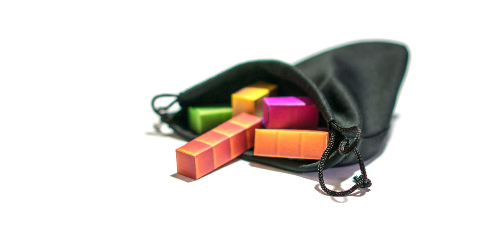

# The history of Tetris randomizers

[The history of Tetris randomizers](https://simon.lc/the-history-of-tetris-randomizers)

# The history of Tetris randomizers

Nov 26, 2018


<!-- more -->

* [Programming](https://simon.lc/tags/programming)
* [Tetris](https://simon.lc/tags/tetris)

In 1985, Alexey Pajitnov and Vadim Gerasimov released Tetris to the public. This fun and highly addictive game challenged players to fit pieces together that were dealt in a *random* order.

Since then, over 150 licensed versions of Tetris games have been released. Varying in game modes, rules, and implementations, they all play slightly—or very—differently.

In Tetris, a randomizer is a function which returns a randomly chosen piece. Over the years, the rules of how pieces are chosen has evolved, affecting gameplay and actual randomness.

Several of them have been reversed engineered and documented. I’ve curated a list of ones that I believed to be important and show how the state of Tetris has changed over the years.

## *Tetris* (c. 1985)

The first and original version of Tetris released had an unbiased randomizer. No opinion to which piece should come next, just pick one and give it to the player.

With an unbiased randomizer, there are situations where the player receives a sequence of the same piece (called floods) or a sequence omitting a certain piece (called a drought). We’ll see how the designers of Tetris games tried to solve these problems in a little bit.

While an unbiased randomizer offers the greatest pure puzzle challenge to players, it is unstable, and can actually [result in an unbeatable sequence (PDF)](http://citeseerx.ist.psu.edu/viewdoc/download?doi=10.1.1.55.8562&rep=rep1&type=pdf). This however can not happen in a real game, as computers don’t use true random number generators. Pseudo random number generators try to mimic real randomness, but don’t have the properties required to deal out 70, 000 Z-pieces in a row.

### Truly Pseudo Random

```js
function* random() {
    const pieces = ['I', 'J', 'L', 'O', 'S', 'T', 'Z'];
    while (true) {
        yield pieces[Math.floor(Math.random() * pieces.length)];
    }
}
```

Puzzle factor: 4/5Flood Prevention: 0/5Drought Prevention: 0/5

## *Tetris*, Nintendo (1989)

Four years later, the immensely popular [NES](https://en.wikipedia.org/wiki/Nintendo_Entertainment_System) version of Tetris was released.

To cut down on piece floods (repeating pieces) a history check was added to the randomizer. This simple check would, 

1. choose a piece,
2. check if the piece was the same as the last,
3. If it was it would chose a new piece, but only once,
4. and whatever was the result, was the piece dealt.

While the chance of getting the same piece twice in a row was reduced, nothing was stopping the game from dealing out alternating pieces. Another common occurrence in this version is a piece drought of over 30 pieces. While every type of tetromino can have a drought, the I-piece is important for scoring in this game, and a big drought can mean the difference between a score max-out or not.

### 1 Piece history with 1 roll

```js
function* historyRandomizer() {
        const pieces = ['I', 'J', 'L', 'O', 'S', 'T', 'Z'];
        let history;
        while (true) {
            * // First "roll"* piece = pieces[Math.floor(Math.random() * pieces.length)]; *// Roll is checked against the history*if (piece !== history) { piece = pieces[Math.floor(Math.random() * pieces.length)]; } history = piece; yield piece; }
        }
```

Puzzle factor: 5/5Flood Prevention: 2/5Drought Prevention: 0/5

## *Tetris: The Grand Master* (1998)

While *NES Tetris* improved on pure unbiased randomization, droughts were still common. *Tetris: The Grand Master*, or *TGM*, essentially used the same system but with a larger history and more rolls to try and alleviate this.

By increasing these values, not only were floods even less common, but it also helped with droughts. Four pieces in the history meant that you had higher chances of getting a piece that hasn’t been dealt for a while. Despite this, there was still no strict rule preventing droughts, they can still happen, just much less frequently than in *NES Tetris*.

### 4 Piece history with 4 rolls

```js
function* historyRandomizer() {
    const pieces = ['I', 'J', 'L', 'O', 'S', 'T', 'Z'];* // First piece special conditions*let piece = ['I', 'J', 'L', 'T'][Math.floor(Math.random() * 4)]; yield piece; let history = ['S', 'Z', 'S', piece]; while (true) { for (let roll = 0; roll < 4; ++roll) { piece = pieces[Math.floor(Math.random() * 7)]; if (history.includes(piece) === false) break; } history.shift(); history.push(piece); yield piece; }
}
```

Puzzle factor: 4/5Flood Prevention: 4/5Drought Prevention: 2/5

## *Tetris Worlds* and Onwards (2001)


*Tetris Worlds* introduced the Random Generator to the masses. Now the official randomizer, most official titles made after this date use it.

History based randomizers helped eliminate floods (or at least diminish them), but could not stop droughts. Given the right circumstances, a deadly piece sequence is still possible.

The Random Generator solves these problems by using a new system called bags. In a bag system, a list of pieces are put into a bag, and piece by piece are randomly picked out until it’s empty. Once the bag is empty, the pieces go back in and the process is repeated. The Random Generator has a 7-bag... or a bag filled with one of each of the 7 tetrominoes. Other types of bags are possible, such as a 14-bag, which includes two of each tetromino.

Having no history from bag to bag allows floods of 2 and snake sequences of 4 (ZSZS,  ZSSZ, etc.) to happen at the seams of each bag. So in some ways it’s a step backwards from the traditional *NES Tetris*.

The 7-bag has a consistent piece output, making it more predictable. It’s easy to know where in a bag you are, and when a piece you need might come. Because of how predictable this random generator is, it’s actually possible to [play forever](https://harddrop.com/wiki/Playing_forever). Overall it’s a silly system that makes you wonder how it ever became the official randomizer.

### The 7-bag

```js
function* randomGenerator() {
    let bag = [];
    while (true) {
        if (bag.length === 0) {
            bag = ['I', 'J', 'L', 'O', 'S', 'T', 'Z'];
            bag = shuffle(bag);
        }
        yield bag.pop();
    }
}
```

Puzzle factor: 3/5Flood Prevention: 3/5Drought Prevention: 4/5

## *Tetris: The Grand Master 3 - Terror-Instinct* (2005)

TGM3 really advances the idea of random generation. It’s a unique system that doesn’t appear in any other release.

Instead of a bag or history, TGM3 uses a pool of pieces. Starting with 5 of each tetromino, for a total of 35 pieces. When a piece is dealt, instead of removing it from the pool, it is replaced with the most droughted piece. Eventually the pool will fill up more and more with this piece until picked. This solves the issues with bag systems, as well as history systems; the best of both worlds.

### 35 Pool with 6 rolls

```js
function* tgm3Randomizer() {
    let pieces = ['I', 'J', 'L', 'O', 'S', 'T', 'Z'];
    let order = [];* // Create 35 pool.*let pool = pieces.concat(pieces, pieces, pieces, pieces); *// First piece special conditions*const firstPiece = ['I', 'J', 'L', 'T'][Math.floor(Math.random() * 4)]; yield firstPiece; let history = ['S', 'Z', 'S', firstPiece]; while (true) { let roll; let i; let piece; *// Roll For piece*for (roll = 0; roll < 6; ++roll) { i = Math.floor(Math.random() * 35); piece = pool[i]; if (history.includes(piece) === false || roll === 5) { break; } if (order.length) pool[i] = order[0]; } *// Update piece order*if (order.includes(piece)) { order.splice(order.indexOf(piece), 1); } order.push(piece); pool[i] = order[0]; *// Update history* history.shift(); history[3] = piece; yield piece; }
}
```

Puzzle factor: 4/5Flood Prevention: 4/5Drought Prevention: 4/5

## Onwards

It's hard to pin point it, but TGM3’s randomizer does feel more predictable, and less challenging. The clumsy 7-bag is unnatural feeling, but allows for many building strategies to be consistently viable. An unfriendly randomizer like in NES Tetris can ruin your game, or more likely, your mood to play.

Can we better these systems by making them more random feeling, and putting hard limits on droughts and floods? Or do these hard limits just make the game more predictable?
