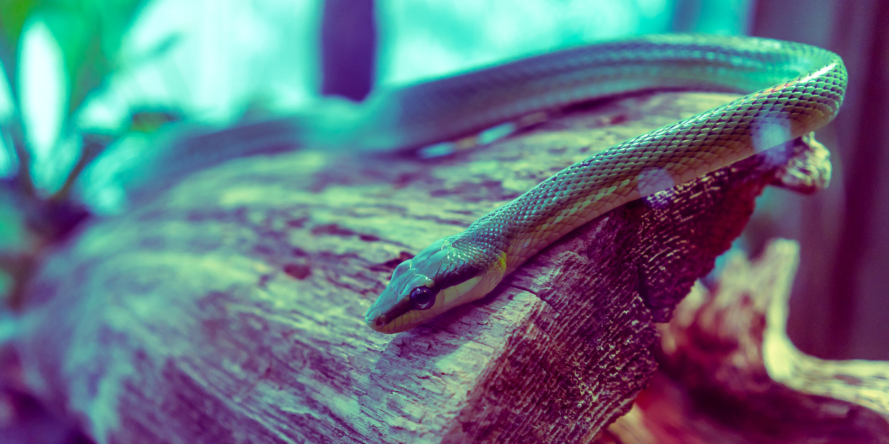

# Snake

```js
var FPS = 10;
var gLoop;
var lastX;
var lastY;

var canvas = document.getElementById('c');
var ctx = canvas.getContext('2d');
var info = document.getElementById('i');
var wrapper = document.getElementById('w');
var classic = document.getElementById('classic');

canvas.width = 500;
canvas.height = 300;
classic.addEventListener('click', init, false);
wrapper.style.width = canvas.width + 'px';
info.style.width = canvas.width + 'px';

document.onkeydown = function(e) {
    snake.keyDown(e);
};

function getRandomInt(min, max) {
    return ~~(Math.random() * (max - min + 1)) + min;
}

function drawBox(x, y, color) {
    ctx.fillStyle = color;
    ctx.fillRect(x + 1, y + 1, 8, 8);
}

function clear() {
    ctx.fillStyle = '#eee';
    ctx.beginPath();
    ctx.rect(0, 0, canvas.width, canvas.height);
    ctx.closePath();
    ctx.fill();

    function grid(increment, color) {
        ctx.fillStyle = color;
        for (var i = 0; i < canvas.width + 1; i += increment) {
            ctx.fillRect(i - 1, 0, 2, canvas.height);
        }
        for (var i = 0; i < canvas.height + 1; i += increment) {
            ctx.fillRect(0, i - 1, canvas.width, 2);
        }
    }
    grid(10, '#ddd');
    grid(100, '#ccc');
}

var food = new function() {
    this.x = 10 * getRandomInt(0, (canvas.width - 10) / 10);
    this.y = 10 * getRandomInt(0, (canvas.height - 10) / 10);
    this.color = '#87af00';
    this.draw = function() {
        drawBox(this.x, this.y, this.color);
    };
    this.eaten = function() {
        this.x = 10 * getRandomInt(0, (canvas.width - 10) / 10);
        this.y = 10 * getRandomInt(0, (canvas.height - 10) / 10);
    };
}

var snake = new function() {
    this.x = canvas.width / 2;
    this.y = canvas.height / 2;
    this.direction = '';
    this.color = '#268bd2';
    this.tail = [];
    this.dead = true;

    this.eat = function() {
        food.eaten();
        this.tail.unshift([this.x, this.y]);
    };

    this.keyDown = function(e) {
        if (this.dead) {
            return;
        }
        switch (e.keyCode) {
            case 38: // Up
                e.preventDefault();
                if (this.direction != 'down') {
                    this.direction = 'up'
                }
                break
            case 40: // Down
                e.preventDefault();
                if (this.direction != 'up') {
                    this.direction = 'down'
                }
                break
            case 37: // Left
                e.preventDefault();
                if (this.direction != 'right') {
                    this.direction = 'left'
                }
                break
            case 39: // Right
                e.preventDefault();
                if (this.direction != 'left') {
                    this.direction = 'right'
                }
                break
        }
    };
    this.update = function() {
        if (!this.dead) {
            if (this.direction == 'up') {
                this.y -= 10;
            }
            if (this.direction == 'down') {
                this.y += 10;
            }
            if (this.direction == 'left') {
                this.x -= 10;
            }
            if (this.direction == 'right') {
                this.x += 10;
            }
        } else {
            this.direction = '';
        }

        // Colision detection
        if ((this.x == food.x) && (this.y == food.y)) {
            this.eat();
        }

        for (var i = 1; i < this.tail.length; i++) {
            if ((this.x == this.tail[i][0]) && (this.y == this.tail[i][1])) {
                this.dead = true;
            }
        }
        if (this.x > canvas.width - 10 ||
            this.y > canvas.height - 10 ||
            this.x < 0 ||
            this.y < 0) {
            this.dead = true;
        }

    };
    this.draw = function() {
        drawBox(this.x, this.y, this.color);
        for (var i = 0; i < this.tail.length; i++) {
            drawBox(this.tail[i][0], this.tail[i][1], this.color);
        }

        if (!this.dead) {
            lastX = this.x;
            lastY = this.y;
            this.tail.unshift([lastX, lastY]);
            this.tail.pop();
        }
    };
}

function gameLoop() {
    // Update
    snake.update();

    // Draw
    clear();
    food.draw();
    snake.draw();

    // Loop
    gLoop = setTimeout(gameLoop, 1000 / FPS);
}

function init() {
    info.style.display = 'none';
    snake.dead = false;
    gameLoop();
}
clear();
```
